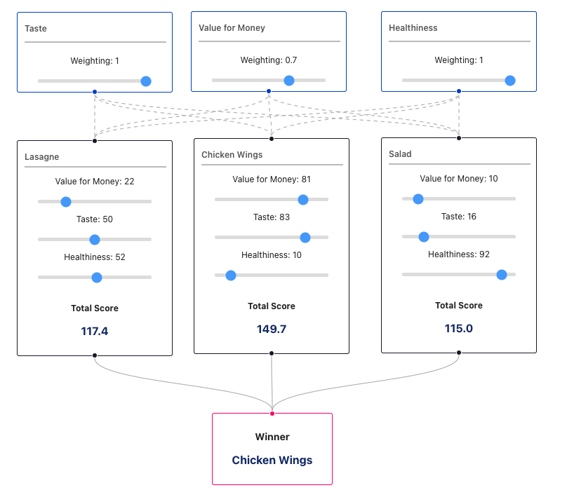

# Sourceful - Frontend Project

A frontend task for Sourceful.io using a open source library I'm unfamiliar with called [React Flow](https://reactflow.dev/). This library allows us to make interactive and dynamic flow diagrams. These are node-based editors and diagrams with edges to connect the nodes in a graph structure.

Find the deployed project [here](https://matts-sourceful-frontend.netlify.app/)

## Screenshot of completed project

